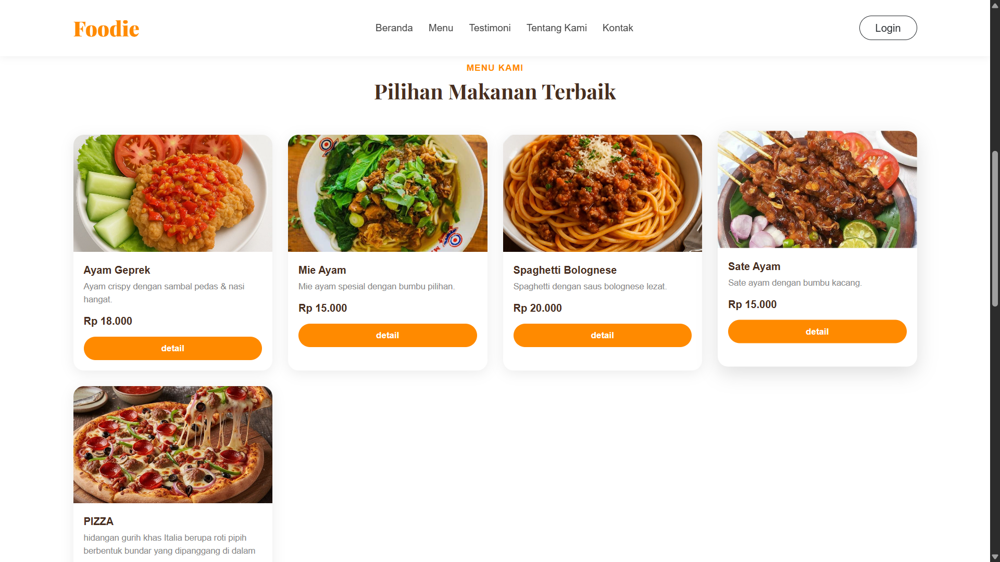

# foodie-website

Website makanan sederhana menggunakan PHP, CSS, JavaScript, dan penyimpanan data berbasis TXT.

## Cara Menjalankan

1. Install Laragon atau XAMPP.
2. Salin project ke folder `www` atau `htdocs`.
3. Jalankan Apache.
4. Buka `http://localhost/foodie-website`.

## Screenshots

### Halaman Beranda

### Halaman Menu

## Halaman Tentang Kami

## Halaman Testimoni & Footer

